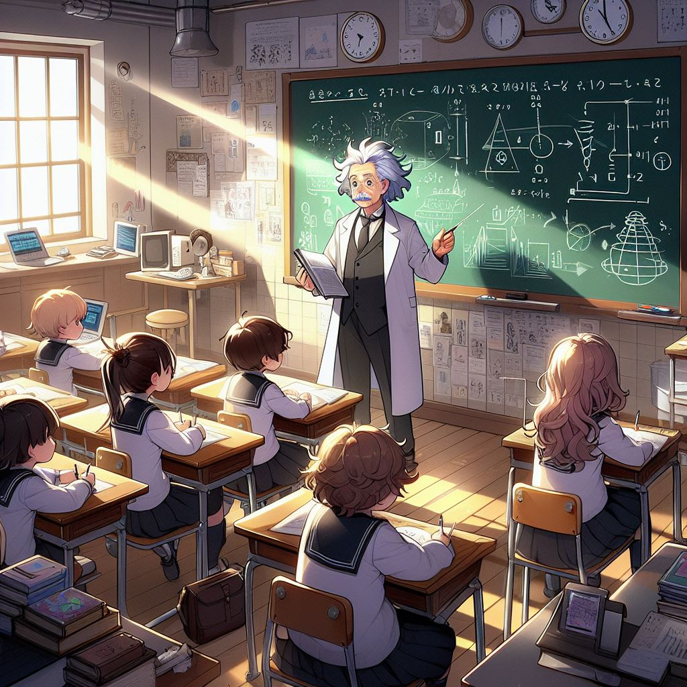

# Getting Einstein to teach you General Relativity - some random thoughts about AI in Education

Imagine being able to ask questions about the The theory of Relativity to Einstein himself. Maybe even watch him derive certain formulas, and see how he arrived at certain conclusions on a blackboard.

Or how about going to a museum, visiting the 'roman exhibit' and being able to ask random questions to people from the Roman times, from Julius Ceaser himself to the average soldier or farmer about their daily life.

The more multi-dimensional and stimulating an event, the more likely you are able to consolidate information in relation to that event. Why unfortunately traumatic events are difficult to forget (the emotional stimulus are high which strengthens the connections in the brain related to it), but also why students learn better when involved in stimulating and active discussions and debates, or they easily pick up information on topics they particularly love. Immersiveness in other words, the thing you always hear is the best way to learn a new language - where the learner appends new information in a deep and densely connected manner; you don't just connect that when you say A + B = C, you see that when you say A + B, it seems to result in C and the laughter of the person you are communicating with, you realize you're more likely to say A + B in a casual public area like a cafe, and so on..

Depth, context, emotion, and more perspectives makes things interesting as they add layers of varied information to the core information.

**Realization**: AI theoretically can add a lot of cheap but interesting context and variance to education of the future that can result in deep 'human'-learning.

Of course, as an adult you might say when I interact with AI I can notice flaws, some might even say Einstein doesn't talk like that for I have read all his written works and yada yada, but for a child or even a young adult, where jumping over critical learning hurdles are so important for long term life outcomes, these flaws will be barely recognisable.

META is ending it's investment in the metaverse, and it's probably still worth doing so if the product is meant to deeply penetrate the whole population given the billions of $ I hear was spent, but something akin to the metaverse lite would likely be a great platform for these sorts of high context and varied deep educational experiences.

And from a geopolitical perspective, it'll be interesting to see the long term differing outcomes of countries who embrace AI in education, and those that are slow to pick it up or disregard it entirely.
