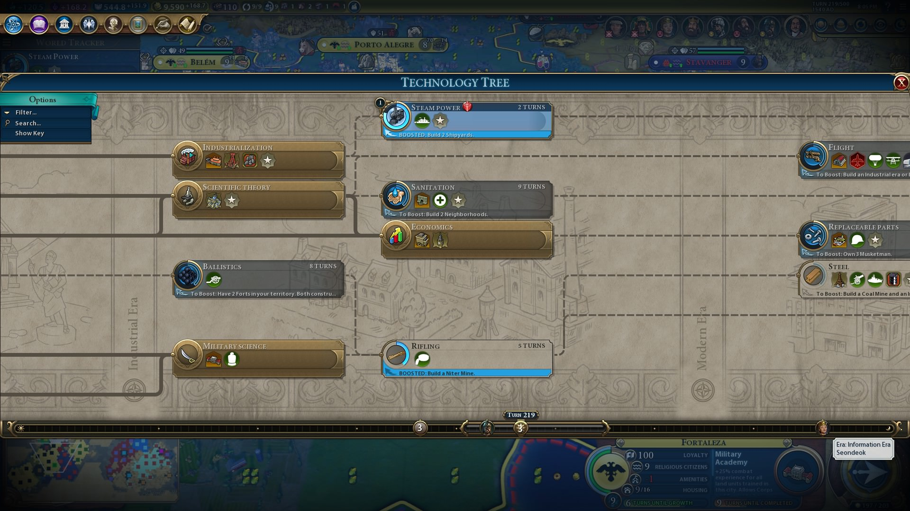

# Exponential technologies that 'jump' into existence, bottleneck thinking, cross pollination, and why cities will never die(?)

> Mammals can be regarded as a broad group called mammaliformes that appeared by the Late Triassic—when dinosaurs were just beginning to diversify themselves—around 220 million years ago1. However, these early mammals were small, primitive and mostly nocturnal insectivores that could not compete with the dominant dinosaurs for the main ecological niches. It was only after the end-Cretaceous mass extinction that wiped out the dinosaurs and other large reptiles that mammals diversified and thrived in the Paleocene epoch.

Everyone probably has heard of how important it is for universities to promote 'cross pollination', that is to say, individuals who studied in a single institution are encouraged to pursue further studies in different institutions, and institutions themselves are discouraged to just keep those they trained themselves.

Everybody has a general intuition of why this might be the case, and why doing so fosters creativity, innovation and collaboration yada yada.

A more concrete way of thinking about it though, might be in relation to the idea of bottlenecks and networks of ideas.

Every idea can be thought of as existing in a network of ideas, say going left to right. Ideas on the right require knowledge of ideas of the left. Players of Civ 6, should feel very comfertable with this.

Ideas on the right can and almost always do depend on multiple ideas on the left, and without having an awareness of all the ideas that an idea depends on (of course, there might be many different routes to an idea, but let's keep it simple), it might be difficult if not impossible to ever come up with that idea.

Sending those you trained to other institutions, and recruiting those trained by others is a good mechanism of diffusing ideas throughout the network of universities, ensuring that well understood ideas spread ensuring that big ideas that are on the verge of discovery aren't held back simply due to scientists not being aware of X or Y idea simply because it is not popular in a single institution, but might be popular in others. In otherwords, this sort of thing tends to result in an increase in the removal of bottlenecks in the discovery of new ideas.

Indeed, many major revolutions in physics could be said to emerge from the application of mathematical methods that had been discovered by others 'recently prior'.

> The development of quantum mechanics in the early 20th century, which relied on the use of linear algebra, operator theory, and functional analysis to describe the behavior of atomic and subatomic systems.

> The formulation of general relativity by Albert Einstein in 1915, which required the use of differential geometry, tensor analysis, and group theory to describe the curvature of space-time and its relation to gravity.

### Technological networks

Technologies are a subset of ideas, and technological revolutions occur the same way. Discovery of new technologies, results in the removal of bottlenecks that lead to the discovery of other technologies.

Many people have probably heard of the phrase: 'People overestimate the progress of technology in the short run, but vastly underestimate the progress in the long run'.

Usually when people imagine the future, they are constrained by basing their views on things they already see, they thus underestimate what will come into existence, and what will be built on the things that come into existence and so on... until what we actually get is often incomprehensable.

A good way of understanding this phenomena is to realize that in short run, most discoveries are relatively minor, and in their space in the network of ideas, they result in incremental improvements. At this point in time, people wonder why progress feels so slow.

As time passes, and these sub-networks of ideas expand as new discoveries are 'appended' on, these sub-networks suddenly encounter and connect with another sub-network which results in a explosion of possibilities.

Over many generations, these sub-networks that were relatively isolated start to combine, over and over in an exponential way, eventually until they allow the creation of new technologies that appear to suddenly emerge - something I like to think of as a 'exponential technology', a technology where many bottlenecks that used to exist suddenly disappear at once, and the final result seems to almost jump out of existence and often drastically take over the space it exists in.

The iphone can be thought of as the perfect exemplar. Mobiles had been around for decades then, and if you go back and study the market, different mobiles produced by different businesses will have sub-components of what eventually became the smart-phone that Apple eventually combined together to create something that seem to 'jump' out of nowhere.

### Cities

Another example of the value in thinking in terms of the emergence of things due to the removal of bottlenecks can be thinking in terms of population densities, given villages, towns and cities.

As villages grow into towns, and towns grow into cities, the numbers in relation to population densities and so on will result in the emergence of new phenomena - the easiest to understand is the increase in 'service' jobs.

The denser the area, the more likely you will have enough people nearby to sustain more 'unique' jobs such as a dog walker, a personal tutor, a personal make up artist, a public speaking consultant/trainer, a dance teacher, a ... Maybe a very well networked village full of outgoing people might have a single dog walker, or a personal tutor, but on average these types of jobs simply don't exist due to the many bottlenecks that supress them from emerging.

Cities aren't always run sustainably and might have other downsides such as the tendency to reduce the number of kids you'll likely feel able to provide for due to the expensiveness of extra space, but it's also very likely that they will never die because of this feature. Simply put, in a big city, if you have enough money, you will likely find someone willing and capable of offering you a solution to any problem you have. For individuals this might not matter that much, but for businesses and especially those that have to constantly adapt in a competitive market, this is something that cannot be undervalued. The removal of certain bottlenecks, allow the emergence of whole new oceans of wealth generation possibilities.

Many people suggest that due to the emergence of working from home, many cities are likely going to die, and I agree somewhat it should be chaotic in the short run, but in the long run I personally am not that pessimistic. It's more likely different types of businesses will just take over the space, ones that can still benefit from these network effects.
