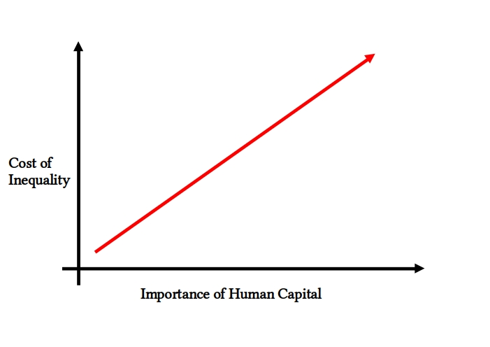

# Yes. Inequality leads to bottlenecks. Yes. Inequality kills GDP (simplified).

The simpler things are explained, the more likely it'll stick and spread.

So here's my attempt at explaining the way inequality negatively influences economic growth in a super simple way, emphasizing GDP since it's a thing everybody sort of has an idea about and feels invested in.

## As the importance of human capital increases, the cost of higher inequality on GDP increases

As a economy develops the importance of human capital increases drastically.

Simpler economies rely on **basic human physical labor** in **basic organisational structures** to produce most goods and services.

Advanced economies rely on **highly educated specialized** workforces in **complex organisational structures** to produce goods and services.

As inequality increases, it erodes at a economies ability to develop human capital to it's maximum, and to organize said human capital in complex ways.

1) Suddenly, the cost of education on average will likely increase drastically due to inequality resulting in less workers able to afford higher education.

2) Suddenly, due to things like rent increases, it's difficult for talented human capital to move to where the demand for their skills is highest.

3) This in turn results in **bottlenecks** that constrain the ability for the networks of talented people all being in the right place at the right time to build more complex organisational structures that are necessary for the production of advanced goods and services.

4) Thus, inequality at this stage hinders GDP due to the economy being unable to fully utilize it's human capital to it's full potential, leading to a slowdown in overall economic growth.

All this makes it sound like the inequality effects mostly advanced goods and services, but even lower level goods and services eventually get affected.

The saying is that the Highstreet is dead due to the internet, but it's also in part due to increased rents and increased costs to travel for consumers. The more unequal the area you live in, you might be suprised to find that a lot of core good services you might have enjoyed no longer can afford to survive in, thus are simply no longer available.

I could write more about things like how inequality also slows down the flow of money in the economy, but again, it's better to keep things simple, and I hope my simple point came across well enough that you will be able to remember it from now on (supposing you agree).

**If you live in a economy where human capital is important, then high inequality is making you poorer.**

p.s. You probably do live in an economy where human capital is important.