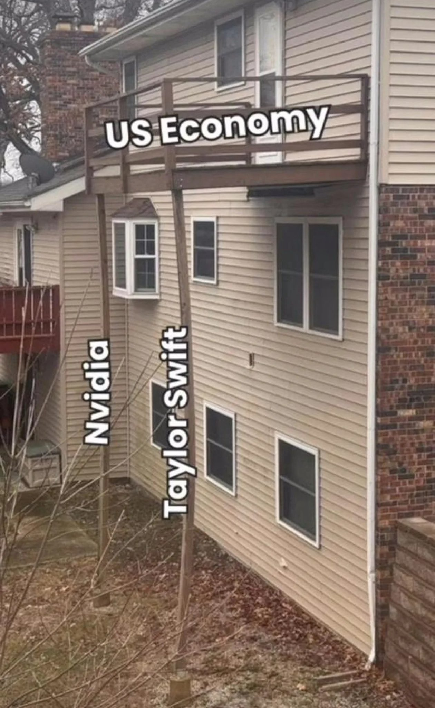

# How important is human capital in AI (a Nvidia hit piece?)

I wrote a blog post a while back about how,

**The more human capital is important in an economy, the more high inequality kills GDP** - this is because as inequality increases, bottlenecks emerge that prevent the economy from utilizing it's human capital to it's full potential - or something along the line.

In truth because I wanted to emphasize the point in that post, I avoided the bit about how in simpler economies inequality can actually be a good thing.

**In simpler economies, inequality can be an advantage because it pools money together to make buying machinery, or building infrastructure more viable**

The key is usually asking the question, 'what is the untapped wealth' that is waiting to be unlocked. For simpler economies, it's often raw materials, for advanced economies it's some new product or service.

A government pools resources to build an airport, suddenly tourism to the region is viable. Suddenly an entire industry is unlocked that brings wealth from abroad. House prices increase, income increases. Demand for more advanced services increases, suddenly new products and services emerge.. A few cycles of this sort of process, and we can end up with something like Singapore (although in Singapore's case, replace the airport with ports).

Governments aren't always good or smart, so in simpler economies you'll often find that inequality allows bigger businesses to emerge and these take on the role of governments to instead unlock 'untapped wealth' (distinct from a too equal society, with a weak government). Being bigger businesses with access to plenty of cheap labour, occasionally this allows them to be able to fund/buy more frontier machinery/technologies/ventures that could lead to the discovery and unlocking a lot of 'untapped wealth'.

Hence, you'll find at least in simpler economies, high inequality doesn't have as much of a downside on growth.

Of course, again, I want to stress this is usually only true in lower level simpler economies that are based around raw material extraction. As again, the more human capital is important, it requires human creativity and similar things to unlock the 'untapped wealth' rather than a new machine or infrastructure. The supressing forces on human capital thus overrides most benefits gained from inequality in more advanced economies leaving only downsides.

Regardless, the reason I am writing all this, is that all the AI led stock market hype sort of reminds me of this relationship between inequality resulting in advantages from the pooling of resources vs the power of pure human capital.

## In the long run scale seems to dominate

There was some guy in the past who said something along the lines of how in the long run compute and how it's exponentially growing will matter more than the human centered top down approach to AI of their time, where people assumed humans 'write AGI' down, rather than the modern approach where AGI is emerging bottom up.

He seems to be right, and modern approaches to AI seem to be about abusing scale and compute.

The advantages gained from pooling resources thus definitely seems to exist. Those that can afford significantly more compute at least in the long run should perform better, even in there might be variance in the short run.

## The progress amongst the open source community, and smaller financially backed startups show that human capital still seems to matter and whatever edge the leaders had in the past doesn't seem unsurmountable each month that goes by (albiet maybe until the next big release?)

The key is that people seem to already be picking winners today as if we live in a simpler economy.

This is resulting in certain companies being overbought. It'd be nice if they sold so that I could buy at a healthier level something something.

The end.